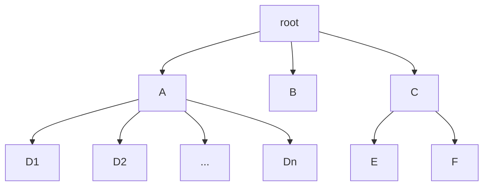

[TOC]

<font face="STCAIYUN" size ="6">Author：DreamSeekerZD</font>

**🤔学习本章需要解决的问题**

①文件内部的数据应该如何组织？[文件逻辑机构]

②文件之间又应该如何组织？[目录结构]

③操作系统应该向上提供哪些功能？[]

④从下往上看，操作系统需要对硬件进行管理，文件数据应如何存放在外存(硬件)呢？[文件的物理结构]

⑤OS如何管理外存中的空闲块[存储空间的管理]

### 🌠文件 

- 文件属性
- **索引结点**
  - 磁盘索引结点
  - 内存索引结点
- 文件的逻辑结构
  - 无结构文件
  - 有结构文件
    - 顺序文件
    - 索引文件
    - 索引顺序文件
  
- 文件的物理结构
  - 连续分配
  - 链接分配
    - 隐式链接
    - 显式链接
  - 索引分配


基本概念：

> 是以**硬盘为载体**的存储在计算机上的信息集合，作为在用户进行**输入输出**时的**基本单位**。

文件属性：

①文件名：**同一目录下**不允许有**重名文件**

②类型：被支持不同类型的文件系统所使用

③标识符：便于OS区分每一个文件

④位置：1.便于用户使用的<u>文件存放路径</u>。2.在外存中的地址，对用户不可见

⑤保护信息：体现在”**不同分组**的用户对文件的访问权限是不同的“


#### 🛫文件的操作


```
```

#### 🛫文件的逻辑地址

##### 🌕文件的分类

①**无结构文件**：文件内部的数据由一系列二进制流或字符流组成🌰txt文件

②**有结构文件**：由一组相似的记录组成，每条记录由若干个数据项组成，根据各条记录的长度是否相等，可分为**定长记录**和**可变长记录**

|—32B—|—32B—|—长度不确定—|

 |—姓名—|—学号—|—特长—|

 倘若对于可变长记录，都分配固定的存储空间，部分学生的空间利用率可能极低。

```
```

##### 🌕有结构文件的逻辑结构

###### 📌==顺序文件：==

1.文件中的记录**逻辑上**是**顺序排列**的。

2.记录在**物理上**可以是**顺序存储或链式存储**.

3.记录可以是**定长的或可变长**的。

4.可根据”<u>记录之间的顺序是否**按关键字顺序**排列</u>“ ，进一步将顺序文件分为**串结构(否)和顺序结构**。


解释：

①对于采用**可变长记录**和**顺序存储**结构的顺序文件，因为记录长度不能呈现某种规律性，无法直接得出某条记录对应的地址。

②采用与关键字无关的串结构，自然无法快速找到某关键字对应的记录；但是**增/删一条记录**相对于采用顺序结构 简单。因为每一次插入或删除操作都不需要重新按关键字排列。

③对于采用链式存储的顺序文件，因为每一条记录仅包含指向下一条记录的指针，记录的寻找需要从头向后遍历故无法实现随机存取

```
```

###### 📌==索引文件：==

<center class="half">


①索引表的各表项 1)**大小相等** 2)在物理上是**连续存放**的	

②索引表的每一个索引项对应文件中的一条记录，逻辑文件中的各记录在物理上**可离散存放**。

③索引表可以抽象成使用了**定长记录**且采用**顺序存储**结构的顺序文件。倘若指向的记录是不固定大小的，即可**变相支持可变长记录的随机存取**

④若将关键字作为索引号内容，且**按关键字顺序排序**时，则可支持折半查找🔍

⑤缺点：文件中每个记录平均占8B，而每个索引表项占32B，且**每个记录对应一个索引表项**，这将导致索引表内容比文件内容还大，纯纯**浪费存储空间**

⑥优点：检索速度快，解决顺序文件不方便增删记录的问题	2）抽象支持**可变长记录的随机存取**

###### 📌==索引顺序文件==

<div class="half">


​    


〇概念：将顺序文件中所有记录分为若干组，在索引表中为每组中的第一条记录建立一个索引项

①改进内容：并不是每个记录对应一个索引表项，而是<u>一个索引表项对应一组记录</u> ；📕：同一组记录中的关键字可以无序，但各组间的关键字是有序的。

②检索效率分析：先顺序查找索引表，再顺序查找各分组。可以根据不同大小的文件建立n级索引表


 ```
 ```

#### 🛫文件的物理地址


①外存中的磁盘块大小与内存物理块大小相等

②<u>和进程地址内存空间分为一个一个页面类似</u>，**文件的地址内存空间**也可细分为一个一个”文件块“，故**文件的逻辑地址**也可表示为（逻辑块号，块内地址）的形式


```
```

##### 🌕连接分配


> ①逻辑文件中的逻辑块**顺序存储**在相邻的块中

> ②地址变换过程：根据OS查询目录表中对应的目录项（FCB），验证用户给出的逻辑块号是否合法。可**直接**根据FCB和逻辑块号算出对应的物理块号，因此该分配**支持顺序访问(从头遍历)以及直接访问(虚空锁敌，骑脸输出)**
>
>  ❗注意：文件目录通常放在磁盘上，在查找<u>目录</u>的过程中，要先将存放目录文件的第一个盘块中的目录**调入内存**。 

🥵缺点：

> ①文件长度**不宜动态增加**，因为增加长度需要大量移动盘块

> ②**存储空间利用率低**，因为连续存储使得部分离散的空间无法得到利用，同时会产生**外部碎片**（可以使用紧凑处理但开销极大）

优点：

> ①访问不同的磁盘块是需要移动磁头，连续分配中的磁盘块是相邻的，其访问磁盘时**需要的寻道数和寻道时间最小**

> ②**支持顺序访问(从头遍历)以及直接访问(虚空锁敌，骑脸输出)**

 ```
 
 ```


##### 🌕链接分配

采用离散分配，消除了磁盘的外部碎片，提高了磁盘的利用率

```
```

###### 📌==隐式链接：==	


概念：

> 1)目录项中只记录文件存放的起始块号和结束块号	

> 2)📕**每个文件**对应一个<u>磁盘块的</u>链表	

> 3)每个磁盘块都含有**指向下一个磁盘块的指针**，这些指针对用户是**透明**的。

🥵缺点：

> ❗1)**读入i号逻辑块需要i+1次磁盘IO**，开销大查找效率低	

> 2)**只支持顺序访问，而不支持随机访问**

> 3)📕稳定性差，运行过程中由于软硬件错误导致指针丢失或损坏，致使数据丢失

优点：

> 1)方便文件的增删，不存在外部碎片问题


```
```

###### 📌==显式链接：==


概念：

> ①提供FAT（文件分配表）用于显式地记录**所有文件**中每一个磁盘块指向的下一个磁盘块。目录表项只需文件的起始块号，因为FAT的每一个表项需要连续存储且大小相等，故**物理块号字段是隐含的**。

> ②	一个磁盘仅设置一张FAT。FAT在系统启动时就会被读入内存，故**查找记录的过程在内存中进行**，不需要访问磁盘

优点：

> 因为查找记录的过程在内存中进行，**减少访问磁盘的次数**

缺点：

> FAT需要占用连续的存储空间

```
```

##### 🌕索引分配


概念：

①文件数据存放的磁盘块称为“**数据块**”，索引表存放的磁盘块称为”**索引块**“

②每个文件都有**索引块(表)**，类似于**页表**。故文件索引表表项大小可以通过磁盘块的数量来计算。

③实现文件的逻辑块号到物理块号的转换：通过文件对应目录项FCB 将其对应的索引表调入内存，

优点：

①支持直接访问，没有外部碎片

缺点：

①增加系统存储空间的开销

###### 📌链接方案


机理：目录项依然只需要记录文件的第一个索引块，每一个索引块含有指向下一个索引块的指针。当想要访问第三个索引块时，就需要从头开始访问，故只支持顺序访问，**地址变换的过程可能产生多次读磁盘的操作**。


###### 多层索引


机理：和多级页表原理相似

地址变换过程：根据逻辑块号/磁盘块大小 得到一级索引表所需查询的表项，根据逻辑块号%磁盘块大小 到得二级索引表所需查询的表项。即可知道逻辑块号存放的磁盘块号


###### 混合索引


机理：包含**直接索引**(直接指向数据块)和间接索引，使得访问小文件的数据块所需的读磁盘次数减少

##### 🤔

需要知晓的知识点：


①各分配方案的实现机理？

②地址变换过程？读写磁盘操作次数？


❗注意(命题方向)：


①文件的最长长度（各级索引表最大不会超过一个块）

 ②磁盘IO次数(注意顶级索引表是否引入内存 )


总结：


#### 🛫物理地址和逻辑地址

①通过C语言编写的文件读写程序可知，在用户看来所有的字符都是连续存放的即**文件占用一片连续的逻辑地址空间**。只需提供我们需要访问的字符，它在文件当中的逻辑地址，就可找到我们想要的任何数据。

②OS视角，都是答辩二进制数据，将文件拆分成若干块 逻辑块号相邻。根据文件管理策略决定数据块 在外存中的分配方式。OS负责将**<u>逻辑地址转换为(逻辑块号，块内偏移量)</u>**同时<u>**OS负责实现逻辑块号到物理块号的映射**</u>

③"fgetc底层使用Read系统调用，OS将(逻辑块号，块内偏移量)转换为(物理块号，块内偏移量)"，整个过程对用户不可见


##### 🤔

链式存储的顺序文件采用链式分配是指：

①文件内部各条记录链式存储，由创建文件的用户自行设计，在用户看来所有的字符依然都是连续存放的即文件占用一片连续的逻辑地址空间

②文件整体采用链接分配，由操作系统决定


索引文件中的索引表是<u>由用户自行建立</u>的，索引分配中的索引表是<u>由OS建立</u>的。

可以使用C语言模拟索引文件

```

```

### 🌠外存空闲空间管理

> ①用什么方式记录、组织空闲块
>
> ②如何分配磁盘块
>
> ③如何回收磁盘块

- 存储空间的划分与初始化
  - 文件区
  - 目录区
    - 包含**文件目录、空闲表、位示图、超级块**等用于文件管理的数据

- 空闲表法
- 空闲链表法
  - 空闲**盘块**链(适用离散分配的物理结构)
  - 空闲**盘区**链(适用离散、连续分配物理结构)
- 位示图法
- 成组(簇)链接法


空闲链表法分配：从**链头**开始检索，按算法规则 摘下多个盘块分配 或 找大小符合的空闲盘区，对于**空闲盘区链**，若没有合适的连续空闲块，可以将不同盘区的盘块同时分配给一个文件。注意修改相应的数据。

位示图法：


成组链接法(了解即可)：

①专门用一个磁盘块作为“超级块”，当系统启动时需要将超级块读入内存，并保证内存和外存中的“超级块”**数据一致**.

②分配:

③回收:(1)回收后 没有或刚好达到**最大空闲块**,直接将对应块的链接信息放入超级块即可(2)倘若回收前就满了, 那么视新回收的块为新的分组, 并将超级块中的数据复制到新回收的块中,那么它就拥有指向下一分组的链接指针.由于超级块永远指向第一个分组,所以让超级块指向这个拷贝了其数据的新分组.


```
```

### 📉文件系统是层次结构(了解即可)


### ✨(New!)文件系统的全局结构

> 了解文件系统在外存当中是如何建立的

①对未划分扇区的原始磁盘**物理格式化**(一级格式化) ，<u>划分扇区并检测坏扇区</u>。**坏扇区的存在对OS是透明的**，但物理格式化后，磁盘驱动器知晓哪块扇区是坏的。倘若OS正好访问到了某一块坏扇区，驱动器就会偷偷地将**备用扇区**替换坏扇区。这是物理格式化的**替换操作**过程。

②逻辑初始化后，磁盘分区(CDE盘)完成各分区的文件系统初始化。每一个分区的大小、地址范围需要用**分区表**记录，**每个分区**能够**独立**建立自己的文件系统。


**超级块**能够快速地找到该磁盘分区中的所有空闲块，当需要分配磁盘块时超级块作用相当显著。**i结点区**：Unix文件系统中的**所有索引结点**都是**连续存储**在i结点区的（支持随机存取）。**根目录**也将在文件逻辑初始化后建立

> 接下来了解文件系统在内存中的结构


①**近期访问过**的**目录**文件会**缓存在内存中**，不用每次都从磁盘读入，这样可以加快目录检索速度

②进程打开表包含在每个进程的PCB中，记录每个进程当前打开了什么文件。系统打开文件表中**打开计数**栏指当前打开该文件的进程数。

每一次打开新的文件会在该用户进程打开表中新建目录项，并拷贝Open系统调用所含参数(打开方式)。进程打开表不会记录文件的描述信息，但含有指向 拷贝了目标文件的系统打开表 的索引指针。

**文件描述符**就是指向进程打开文件表某一表项的指针

③用户要执行**读操作**，OS会根据接收到的Read系统调用的参数，首先在进程打开文件表中找到对应条目，并根据索引信息找到系统打开文件表当中对应的条目，然后OS会根据该文件FCB的信息**确定**其**在外存中的位置**

### ✨(New!)虚拟文件系统

普通的文件系统的特点：

①使用不同外部存储设备(移动硬盘和U盘等)的格式各不相同，具有相同功能的操作在不同的文件系统中可能需要调用的不同的API，这就使得用户编码极不方便．

②不同文件系统所表示的文件**物理结构各不相同**，打开文件后，其在内存中的表示也不同🌰UFS文件系统的目录项含索引结点而FAT～包含所有的信息。

  虚拟文件系统的特点：

①VFS要求下层的文件系统必须实现某些**规定的函数功能**，如: open/read/write.一个新的文件系统想要在某操作系统上被使用，就必须满足该操作系统VFS的要求。

②向上层用户进程提供**统一标准**的系统调用接口🌰，**屏蔽**底层具体文件系统的**实现差异**

③每打开一个文件，VFS就会在**主存**中创建一个**vnode**,用于统一不同文件系统的数据结构。打开UFS文件系统中的文件时，会将其inode从外存调入内存并将inode指向内容拷贝给vnode。vnode中的**函数功能指针**指向具体文件系统的函数功能(不同文件系统的实现代码不同)。


#### U•ェ•U文件系统的挂载(安装)

>  了解如何将文件系统挂载到OS中

①在VFS中注册新挂载的文件系统，内存中的挂载表新增表项添加文件系统的相关信息。

②新挂载的**文件系统**，要向VFS提供**函数地址列表**

③将新的文件系统加到**挂载点** （某个**父目录**下），


### 🔥文件大题解构

> 
>
> [①Windows的DOS文件系统+采用显式链接-FAT](#DOS)
>
> [②Unix的UFS文件系统采用混合索引][#UFS]
>
> 

#### 😀<span id="DOS">DOS</span>

①FAT和根目录存在**固定位置**：开机时可以从根目录出发，找到系统初始化相关的各种文件。	


|            外存存储空间             |
| :---------------------------------: |
| 0号块：用于引导操作系统初始化的程序 |
|             1号块：FAT              |
|             2号块：FAT              |
|             3号块：FAT              |
|            4号块：根目录            |
|                                     |
|                                     |
|                                     |
|                                     |


```
```

假如进程页面大小和磁盘块大小均为1KB，下图为外存中4号块的存储内容。

| 文件名 | 文件类型     | 文件大小     | 起始块号 |
| :----: | ------------ | ------------ | -------- |
|   A    | 目录文件     | 略           | 5        |
|   B    | 普通文件.mp3 | 3个块(2.5kb) | 10       |
|  ...   | ...          | ...          | ...      |


```
```

下图为文件系统中目录、文件关系示意图A、C为目录文件。




```
```

倘若QQ音乐想要打开B文件，需要找到文件对应的目录项。

| QQ音乐虚拟地址空间 |
| :----------------: |
|                    |
|                    |
|                    |
|                    |


```
```

”想听音乐但是快进“的大概过程：

①开机时OS会将**根目录**信息会被读入内存，~~假如读入内存中的11号页框~~。QQ音乐进程可以使用Open系统调用，指明它想要打开根目录下的B文件。

②根据**B文件的FCB**可得文件的“**起始块号**”，由于FAT表在开机时也会被OS读入内存~~(假如被读入0号页框)~~，故通过**查询FAT表**，<u>找到B文件中**任何一个逻辑块**所存储的**物理块号**</u>。执行完Open，OS会给进程返回**fd文件描述符**(相当于文件指针)

③由于在用户的视角里，文件占用一片连续的逻辑地址空间。“欲要听最后的0.5分钟”只需读入最后0.5KB大小的数据块即可。故使用read(fd,<u>2.0kb~2.5kb(逻辑上的)</u>)系统调用，请求OS将目标数据块从外存读入内存~~( 假如读入15号页框)~~。**OS会将(2.0KB~2.5KB)转换为最终的物理块号。**

④进程访问内存中对应的页框，建立页表页框完成地址映射~~(假如B文件3号块存储在进程空间的5号页)~~ ，然后执行相关代码...

**过程本质**是**对目标文件不同的逻辑地址进行读操作**，FCB确定文件块首地址，FAT确定块间关系。

~~⑤倘若B文件换为目录文件A，首先通过根目录找到其FCB。由于目录文件由多个FCB组成，OS通过其“起始块号”和FAT找到A所有逻辑块所存储的物理块号，将它们**全部读入内存**。然后找到目标文件，使用Open打开它....~~

> 大概考题：整个过程读磁盘的次数

❗注意目录文件所占据的磁盘块不一定要全部读入，因为已读入的磁盘块中可能含有最终需要访问的目标文件。

缺点：目录文件过大会占用多个磁盘块，导致寻找目标文件需要读入大量磁盘。

```
```

#### 😩<span id="UFS">UFS</span>

特点：

①使用inode对目录文件进行”瘦身“，使目录文件尽可能地占用少许磁盘块

②由**固定大小**索引结点组成的inode区存储在**固定位置**，FCB可根据inode编号和inode区的起始地址对inode实现随机读取。OS欲获取对应inode中的信息，需要通过<u>一次读磁盘</u>操作<u>将该inode调入内存</u>(真题考试要求如此，事实上OS可能会读取多个连续的inode)

③❗注意目录文件所占据的磁盘块不一定要全部读入内存，因为已读入的磁盘块中可能含有最终需要访问的目标文件。

 ④在Read系统调用过程中，OS会将用户指出的**合法逻辑地址**转换为物理地址，把实际包含数据的磁盘块调入内存。🌰读取1.5kb内容以及磁盘块大小1kb，即读取第二个磁盘块，由于混合索引支持随机访问，无须顺序读入第一块

⑤<u>间接索引工作过程</u>：假如需要访问文件的第12块，而直接索引和一级间接索引共10个块，这时需要访问一级索引的第二个块，需要将该**一级索引表读入内存**。


```
```

